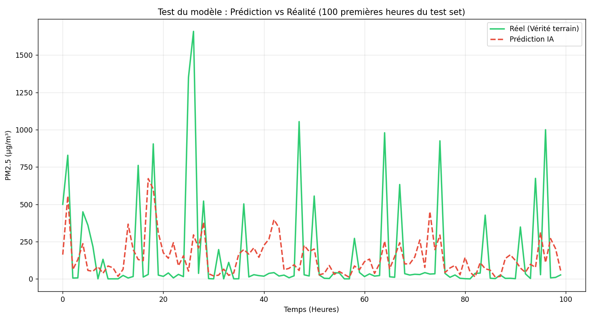

# Prediction-de-la-pollution-ville-de-Dakar-Senegal

## 📌 Présentation du Projet
Ce projet a été réalisé dans le cadre d'une étude personnelle sur la surveillance de la qualité de l'air dans les villes africaines (focus sur Dakar, Sénégal). L'objectif est de prédire la concentration de particules fines : **PM2.5**(Particulate Matter sont des particules fines dont le diamètre est inférieur à 2,5 micromètre s; c'est l'indicateur le plus critique pour la santé publique, particulièrement dans des zones urbaines denses comme Dakar.) à l'aide de techniques de Machine Learning, en utilisant des données réelles provenant de l'API **OpenAQ**.

Ce projet démontre une capacité à gérer un pipeline Data complet : récupération, nettoyage (Data Engineering), enrichissement (Feature Engineering) et modélisation.

##  Stack Technique
- **Langage :** Python 3.x
- **Librairies :** Pandas, Scikit-Learn, Matplotlib
- **Modèle :** RandomForestRegressor (Forêt Aléatoire)

##  Pipeline de Données
1. **Ingestion :** Récupération de données historiques (741 mesures) via le capteur "CEM Martin Luther King" à Dakar.
2. **Nettoyage :** Gestion des formats de date, suppression des doublons et tri chronologique.
3. **Feature Engineering :**
   - Extraction de l'heure et du jour de la semaine.
   - Création d'une variable **Lag-1** (valeur de l'heure précédente) pour capter l'inertie.
   - Création d'une **Moyenne Mobile** sur 3h pour lisser les anomalies.

##  Résultats et Analyse
Le modèle utilise 80% des données pour l'entraînement et 20% pour le test (sans mélange).
Il a un score de 1.40%, ce qui montre ses limites. L'analyse des erreurs prouve que la pollution à Dakar ne dépend pas que du passé immédiat ou de l'heure. Pour améliorer ce score, il est indispensable d'intégrer des variables exogènes : la direction du vent (qui ramène la poussière du désert), l'humidité, ou les flux de trafic en temps réel.

### Performance actuelle :
- **Erreur Moyenne (MAE) :** 170.75 µg/m³
- **Importance des variables :** - `pm25_lag1` : ~63% (Forte dépendance au passé immédiat)
  - `heure` : ~22% (Cycle jour/nuit)

### Visualisation :

> **Note d'analyse :** Bien que le modèle suive la tendance globale, l'erreur importante souligne la complexité de la pollution à Dakar. Les pics soudains (passant de 1 à 200 µg/m³) indiquent que des facteurs externes (vent de sable - Harmattan, trafic, humidité) sont indispensables pour une prédiction de haute précision.

##  Améliorations futures
- [ ] Intégration de données météorologiques (API Open-Meteo) : Vitesse et direction du vent.
- [ ] Test de modèles plus complexes (LSTM / Réseaux de neurones récurrents).
- [ ] Déploiement d'un tableau de bord interactif avec Streamlit.
